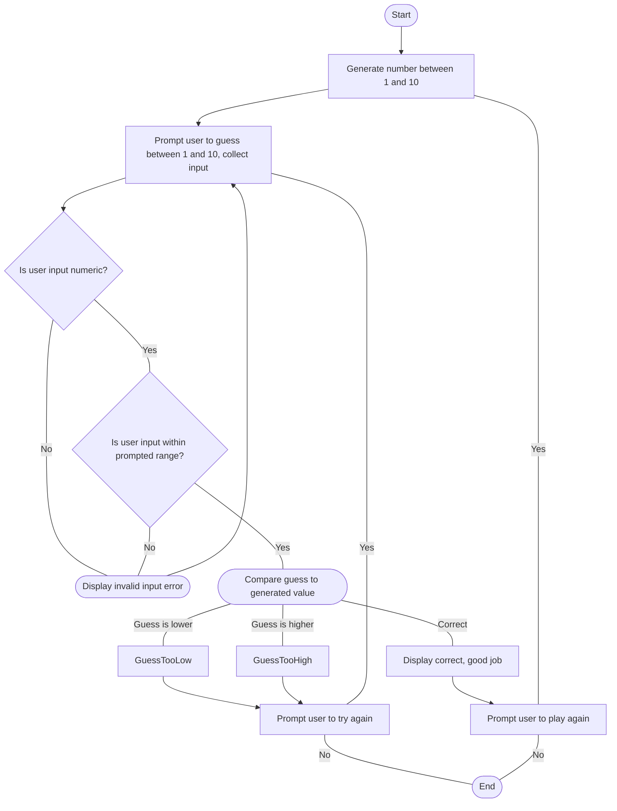

```mermaid
flowchart TD
    Start([Start])
    GenerateRandom[Generate number between 1 and 10]
    PromptUser[Prompt user to guess between 1 and 10, collect input]
    EnsureNumeric{Is user input numeric?}
    EnsureWithinGuessBounds{Is user input within prompted range?}
    InvalidInput([Display invalid input error])
    TryAgainPrompt[Prompt user to try again]
    PlayAgainPrompt[Prompt user to play again]
    CheckGuess([Compare guess to generated value])
    GuessCorrect[Display correct, good job]
    End([End])

    Start --> GenerateRandom --> PromptUser --> EnsureNumeric
    InvalidInput --> PromptUser

    EnsureNumeric ---|Yes| EnsureWithinGuessBounds
    EnsureNumeric ---|No| InvalidInput

    EnsureWithinGuessBounds ---|No|InvalidInput
    EnsureWithinGuessBounds ---|Yes|CheckGuess
    

    CheckGuess ---|Correct|GuessCorrect --> PlayAgainPrompt
    CheckGuess ---|Guess is lower|GuessTooLow
    CheckGuess ---|Guess is higher|GuessTooHigh

    GuessTooLow --> TryAgainPrompt
    GuessTooHigh --> TryAgainPrompt

    TryAgainPrompt ---|Yes|PromptUser
    TryAgainPrompt ---|No|End

    PlayAgainPrompt ---|Yes|GenerateRandom
    PlayAgainPrompt ---|No|End
```