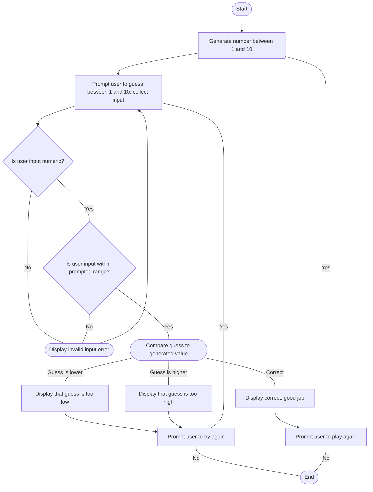

#### Documentation:

GenerateRandom: Generates value between 1 and 10
PromptUser: Asks user to enter a value between 1 and 10 and collects input
EnsureNumeric: Ensures that the entered value is a valid integer. Display invalid input error if not and reprompt.
EnsureWithinGuessBounds: Check if guessed value is within 1-10, as prompted before. Display invalid input error if not and reprompt.
CheckGuess: Checks if the value is correct first. If false, check if lower, and if not lower, then check if higher. Communicate the status of their guess (too high or low) and ask user if they would like to try again. If correct, ask user if they would to play again with a new number. If so, start again at GenerateRandom. If not, terminate program.